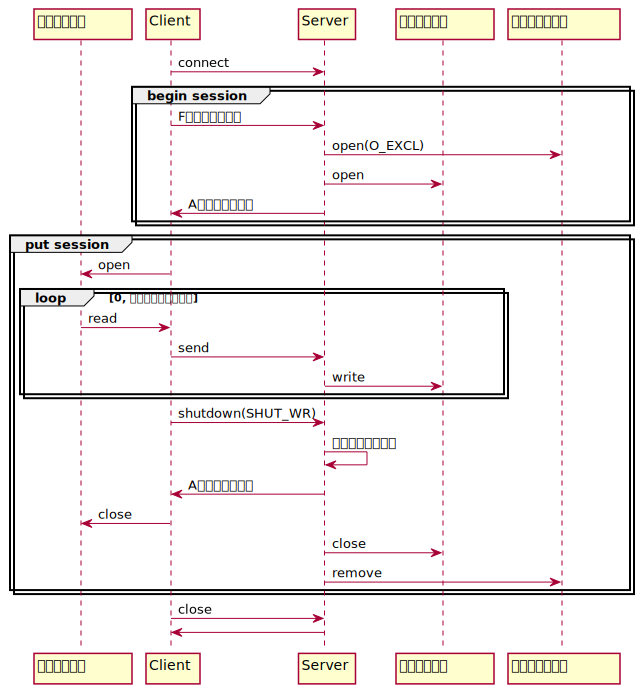
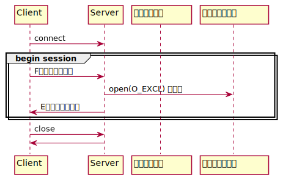
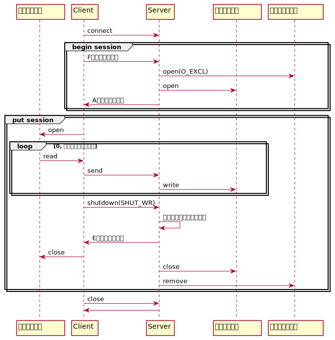
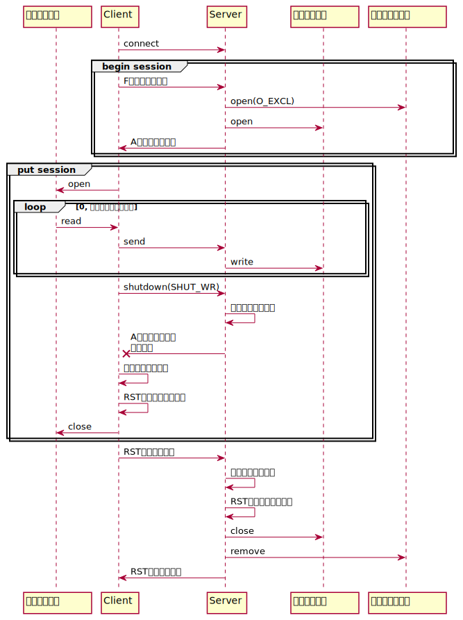

:lang: ja
:doctype: book

= ソケットプログラミング課題
ネットワーク上のマシンAからマシンBへ、ソケット経由でファイル転送を行うプログラムを作成せよ

== usage

.サーバ起動
----
trans-data-server -p port [-s files-store-directory] [-d]
-p: 起動ポート番号
-s: 転送されたファイルを格納するディレクトリのパス
-d: デバッグモードを有効にする
----

.ファイル転送
----
trans-data-client -h hostname -p port -f filename [-d]
-h: サーバのホスト名 or IP address
-p: サーバが起動しているポート番号
-f: 転送するファイルのパス
-d: デバッグモードを有効にする
----

== サーバ実装

=== マルチクライアント対応
サーバが同時に複数のクライアントからファイルを受信できるようにするため、
サーバ側はマルチスレッドで実装する。

==== 複数クライアントから同名のファイルを送られた場合
複数のクライアントから同時に同名のファイルを送信された場合、
ファイル内容が破壊されてしまうため、サーバ側は受信ファイルのオープン前に対象ファイルのファイルロックを取得する。 +
ロックファイル名は「.ファイル名.lock」とし、ロックファイルをO_EXCLフラグを有効にしてopen(2)を実行することで、簡易的なアドバイザリロックを実装する。 +
受信完了後は、ロックファイルは削除する。 +
ロックを取得できなかった場合は、クライアント側にエラーを返し終了する。

=== 受信ファイル保存場所
クライアントから送信されたファイルは、サーバ起動時に「-s」オプションで指定されたディレクトリに出力する。 +
サーバ起動時に「-s」オプションが指定されなかった場合、サーバを起動したディレクトリに出力する。

=== データサイズ検証
クライアントから送られてきたファイルを問題なく受信できているかを確認するため、送信開始時にクライアント送られてくる送信ファイルサイズとサーバ側で受信できたデータサイズを比較検証する。
本来であれば、簡易的なハッシュを使って検証すべきだが、今回は実装を簡略化するためデータサイズのみで比較する。

== サーバ/クライアント共通実装
=== デバッグモード
デバッグモードを有効にした場合は、サーバは起動したカレントディレクトリに実行ログ「trans-data-server.pid」を作成する。 +
クライアントは、stderrにログを出力する。 +
サーバはデーモン化する関係で制御端末を切り離すためファイル出力により対応するが、
クライアントはデーモン化しないのとユーザビリティの観点からstrerrにログを出力する。

出力フォーマットは以下のように先頭からLINEまでをヘッダとし、ここは90バイトの左詰め。
また、ヘッダ+メッセージを合わせて512バイトにする。

----
yyyy/mm/dd HH/MM/SS.nsec thread_id FILENAME:LINE message
----

=== タイムアウト
ネットワークを介したファイル転送を行うため、通信環境によっては接続断などが発生する可能性があるため、送受信タイムアウトと接続タイムアウト機能を実装する。 +

==== 送受信タイムアウト
一定の時間send/recvがブロックした場合のタイムアウト。 +
外部ファイルからユーザが任意に設定できるのが理想ではあるが、今回は簡略化のため「20秒」の固定値とする。 +
接続済みソケットでタイムアウトを検知した場合、それ以上待ってもパケットはこないと判断し、ピアに対してRSTパケットを送信して、ソケットを切断する。

==== 接続タイムアウト
クライアントからサーバへの通信確立を行う際のタイムアウト。 +
外部ファイルからユーザが任意に設定できるのが理想ではあるが、今回は簡略化のため「20秒」の固定値とする。

=== 致命的エラーへの対処
メモリ確保エラーやシステムコールの想定外のエラーなどプログラムを正常に動作させることが難しくなった場合は、ピアに対してRSTパケットを送信してソケットを切断する。

== メッセージシーケンス
サーバ/クライアントは、以下の流れでメッセージをやり取りし、クライアントからサーバにファイルを送信する。

.正常系

.ファイルロック取得エラー

.データサイズ検証エラー

.クライアントでタイムアウト検知

=== セッション
サーバ/クライアントは、以下の２つのセッションによりファイル転送を行う。

1. begin session: 送信ファイルサイズ、ファイル名をサーバに送る
1. put session: 送信ファイルのデータをサーバに送る

== メッセージフォーマット

=== Fメッセージ
クライアントからサーバに送信ファイルサイズと送信ファイル名を通知するために使用する。

[cols="3,1,1,1,3", options="header"]
|===
|項目名
|バイト数
|開始位置
|タイプ
|用途

| メッセージタイプ
| 1
| 1
| ASCII
| F

| ファイルサイズ
| 8
| 2
| 符号なし整数
| 送信ファイルサイズ

| ファイル名
| 200
| 9
| ASCII
| 送信ファイル名(\0終端)
|===

=== Aメッセージ
処理の正常完了をピアに対して通知するために使用する。

[cols="3,1,1,1,3", options="header"]
|===
|項目名
|バイト数
|開始位置
|タイプ
|用途

| メッセージタイプ
| 1
| 1
| ASCII
| A

|===

=== Eメッセージ
処理がエラー終了したことをピアに対して通知するために使用する。

[cols="3,1,1,1,3", options="header"]
|===
|項目名
|バイト数
|開始位置
|タイプ
|用途

| メッセージタイプ
| 1
| 1
| ASCII
| E

| エラーメッセージ
| 1024
| 2
| ASCII
| ピアに通知するメッセージ(\0終端)

|===

